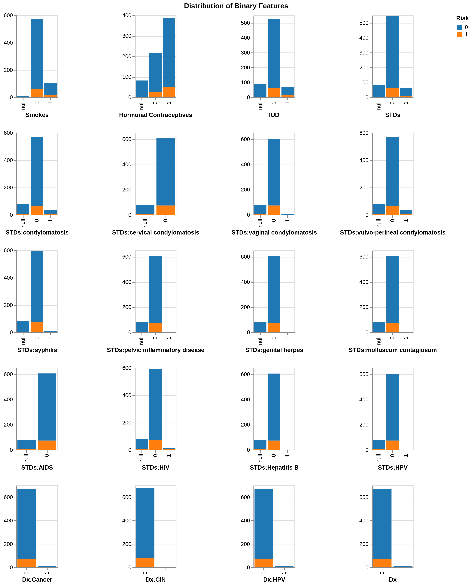
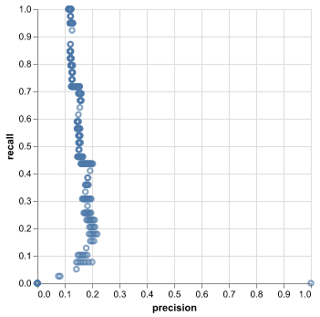
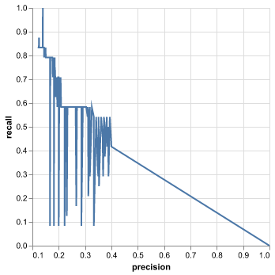
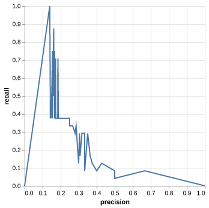
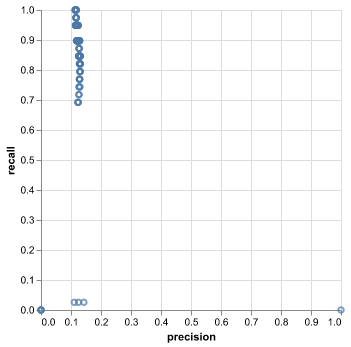

```{r setup, include=FALSE}
knitr::opts_chunk$set(echo = TRUE)
library(tidyverse)
```

## The Goal

To create a machine learning model that can accurately diagnose or stratify risk for cervical cancer based on lifestyle factors, sexual history, and STI comorbidities.

## Problem Background

Cervical Cancer is the second most common cancer in women worldwide, and disproportionately affects poor regions, particularly in Latin America, Sub Saharan Africa, and the Indian Subcontinent. (@petignat2007diagnosis). It is most often caused by exposure to Human Papillomavirus (HPV), especially in unvaccincated individuals. (@castellsague2008natural). It has been found that early diagnosis can allow for an 80-95% success rate of surgery or chemotherapy, making early diagnosis extremely important. (@petignat2007diagnosis). Because HPV is a sexually transmitted infection, a significant body of literature exists exploring statistical links between cervical cancer/HPV and lifestyle, sexual history, and other STIs. For example, Bosch's "Risk Factors for Cervical Cancer in Columbia and Spain" (@bosch1992risk) which found strong links between hormonal contraceptives and cervical cancer. Because of limited health services and education in regions where HPV/ Cervical Cancer are most prevalent, a niche exists for an analytical tool that can be used to assess risk using only basic questions and medical history, identifying individuals who are at risk to shortlist them for further assessment.

## The Dataset

This data is sourced from 'Transfer Learning with Partial Observability Applied to Cervical Cancer Screening.'(@fernandes2017transfer). It was accessed through the UCI Machine Learning Repository, found here: <https://archive.ics.uci.edu/ml/datasets/Cervical+cancer+%28Risk+Factors%29>. The data is composed of survey results and medical records for 858 female patients from 'Hospital Universitario de Caracas' in Caracas, Venezuela, alongside the results of four traditional diagnosis tests (i.e. biopsy).

## Methods

#### Splitting, Cleaning and EDA

Data was first split 80/20 into a training and test set. Exploratory Data Analysis (EDA) was carried out on the train set and can be replicated use the scripts provided in the usage section. Key EDA findings include some features having an extremely large number of missing or null values due to the personal nature of the questions involved (i.e. number of sexual partners), with many respondents preferring not to say. There was also a significant prevalence of class imbalance for many features, including the targets. While this is not inherently problematic thanks to balancing arguments in the models, the small size of the data set (n = 858 pre split) means this analysis relies on a very small number of positive examples, reducing statistical power. Examples of this class imbalance is shown below, with the bottom row being the potential targets.

------------------------------------------------------------------------

```{r echo = FALSE, fig.cap = "Figure 1: EDA for Binary/ Categorical Features", out.width = '50%', fig.align = 'center'}

```

------------------------------------------------------------------------

#### Modelling

Machine Learning models were then applied using Scikit-Learn (@scikit-learn). The modelling process involved training and testing the dataset on a variety of models to investigate what algorithms might be suitable for this problem. Models tested include Decision Trees, kNN, SVC, Naive Bayes, Logistic Regression, and Random Forests. All models were initially assessed with default hyperparameters, with kNN and Decision Trees being eliminated due to poor performance. Remaining models were optimized via hyperparameter tuning and applied to the test set.

Models were assessed primarily on the criteria of maximum recall to minimize Type II Error, with a proposed working threshold of 0.28 precision (twice the sample positive rate), deliberately set quite low due to the dangers of false negatives in the diagnosis/ risk identification context.

Test set results are presented in the results section below.

#### Packing and Automation

Packaging of this analysis was done using docopt scripts (@doc).

## Results

Results of this analysis are unfortunately disappointing, as no model seems to provide sufficient performance to merit deployment as a diagnosis tool, though there is some limited application as a non-independent risk flagging system discussed below. Our hope for a strong model was a recall of 0.8 at a precision of 0.28. This is a high recall goal, but given the dangers of Type II error (failing to flag at risk individuals), recall is essential, and is the reason for our deliberately lower precision.

PR Curves against the validation set are shown below:

```{r echo = FALSE, fig.cap = "Figures 2 and 3: PR Curves, Logistic Regression (Left) and Naive Bayes (Right)", fig.show = 'hold', out.width = '50%'}


```

```{r echo = FALSE, fig.cap = "Figures 4 and 5: PR Curves, Random Forest Classifier (Left) and Support Vector Classifier (Right)", fig.show = 'hold', out.width = '50%'}


```

We can see from these plots that even the best performing models (i.e. Naive Bayes), capture less than 50% of true labels (women with a cervical cancer diagnosis) at only 28% precision. Missing 50% of cancer cases is not an acceptable margin of error in this context, especially considering the low precision threshold, where just under three in four women flagged by our model would be false positives.

Also concerning is the highly steep nature of these plots, indicating that small changes in the threshold value can cause massive shifts in scoring. While some level of jaggedness/ steepness in PR curves is normal, these plots are much steeper than expected. This is likely caused by the small number of true data points in the validation set (where capture or non capture of a few points can dramatic change the scores). A lack of separation in the predicted probabilities of each class may also be a factor, where many true and false examples are grouped at similar prediction probabilities, indicating that these classes may be poorly separable (i.e. cannot be separated by a single hyperplane for logistic regression), or that their separation is poorly described by our features.

```{r echo = FALSE, message = FALSE}
df <- read_csv("../results/test-results.csv")
knitr::kable(df, caption = "Table 1. Test set scores (Precision, Recall, f1, AUC) for optimized models")
```

The table above shows numerical results for evaluation on the test set at the 0.5 `predict_proba` threshold. We do observe slightly better results on the test set, possibly because the test set is slightly larger, and so provides smoother results. Naive Bayes remains the strongest classifier. Further investigation would lead us to investigating these values at different operating thresholds (such as our 0.28 chosen operating threshold), but based on the curves above, threshold manipulation is not enough to produce independently viable models.

These plots and test results show that these models are not sufficient to produce accurate diagnoses on their own. This may be due to the limited sample size, particularly of positive examples, or simply that the features provided do not sufficiently account for the variance of the target and a conclusive diagnosis cannot be made based on adjacent-factor risk data. This second point is almost certainly true, as the mechanism of cancer development is not simple cause-and-effect but is inherently stochastic, limiting the effectiveness of any model applied.

## Conclusion and Next Steps

While the results are disappointing, these models may still have some application in a flagging system. While this does not replace normal diagnostic checks, we can logically infer that individuals flagged by these models are at least more likely to have cervical cancer, and a positive flag can provide motivation for further testing, especially if these models were used in parallel and a single individual received multiple flags.

Further exploration may be meritted to investigate other models that may more accurately capture the data/target relationship, feature engineering and transformation, and testing of model decision thresholds based on the PR curves.

## References
